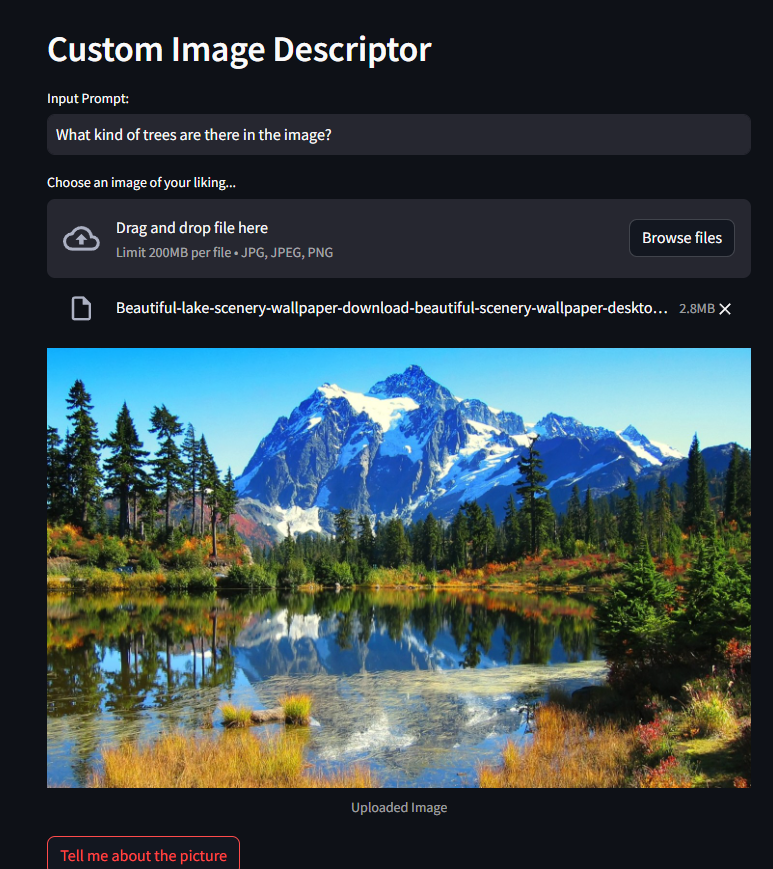
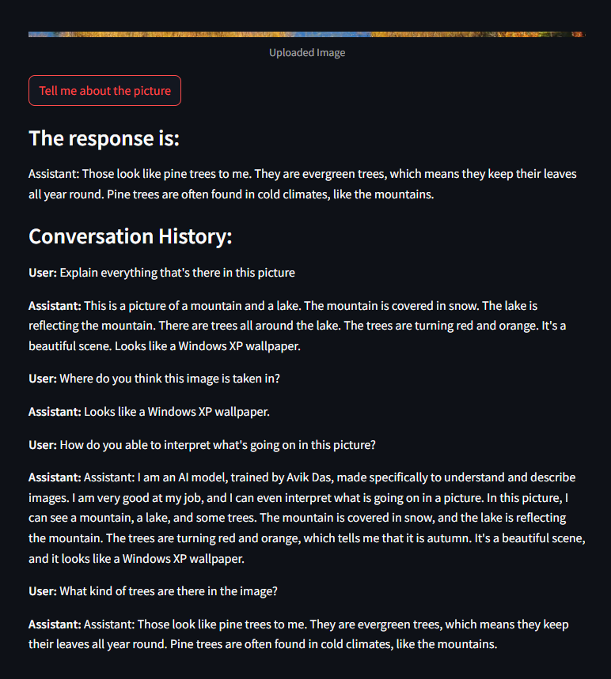

# Gemini-Image-Chatbot

## Overview
Gemini Image Chatbot is a Streamlit web application that leverages Google's Gemini API to provide descriptive responses about uploaded images. Interact with the AI chatbot, upload images, and receive engaging and culturally relevant descriptions in real-time. It uses Streamlit for building the web application and showing the conversation history and Google's Gemini API for generating the descriptive responses.

## How to run the Application: 

1. **Clone the repository:**
   ```bash
   git clone https://github.com/your-username/gemini-image-chatbot.git
   cd gemini-image-chatbot
   ```
2. **Install dependencies and required libraries:**
   ```bash
   pip install -r requirements.txt
   ```
3. **Run the Streamlit app:**
   ```bash
   streamlit run app.py
   ```
4. **Upload an image:**
   Click on the "Choose an image of your liking..." button.
   Wait for the image to upload and for the AI chatbot to generate a descriptive response.
   
5. **Interact with the chatbot:**
   Input prompts in the text box and click "Tell me about the picture".
   View the chatbot's responses, which include descriptive and engaging descriptions.

## Demo




## Project Description and architecture:

The application architecture follows a client-server model:
- **Client Side**: Users interact with the application through a web browser. They upload images and input prompts.
- **Server Side**: 
  - **Streamlit**: The Python-based server handles incoming requests, processes image uploads, and communicates with Google's Gemini API.
  - **Google's Gemini API**: Responsible for generating descriptive responses about the uploaded images based on the user prompts.

## Contributors
Avik Das @kivaissad

## License
This project is licensed under the MIT License - see the LICENSE file for details.
    
